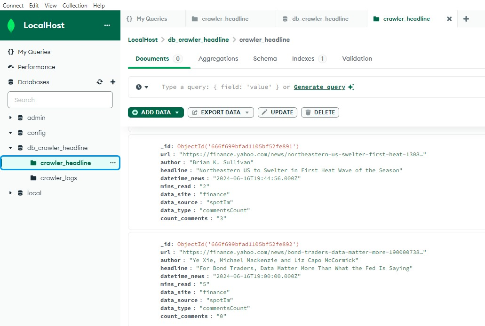
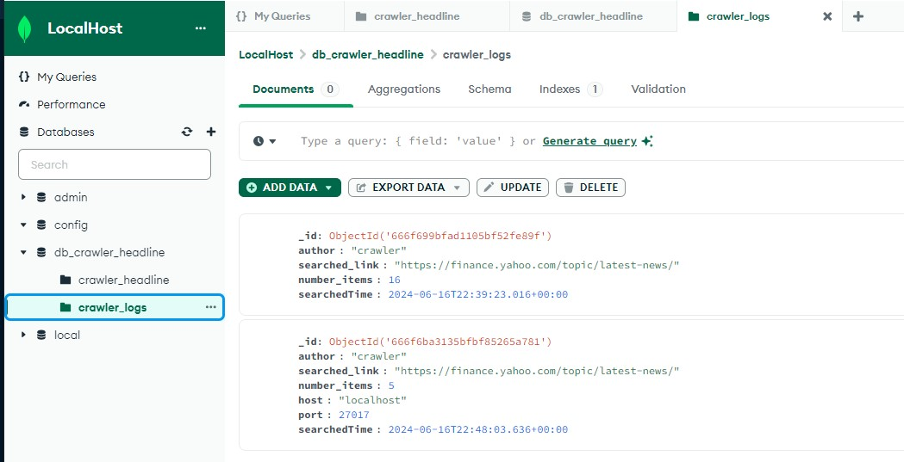

# Crawer Headlines
This project aims to collect data from Yahoo Last News and insert them in a mongodb database for futher text analysis.

## What did we scrap?

## Roadmap
[x] Data collect
[x] Data treatment
[x] Scripts in Jupyter Notebooks
[x] Scripts in .py files 
[x] Insert data into local host (mongodb)
[] Create a docker container for the database
[] Create a docker container for the main script
[] Create a docker compose flow to execute the project